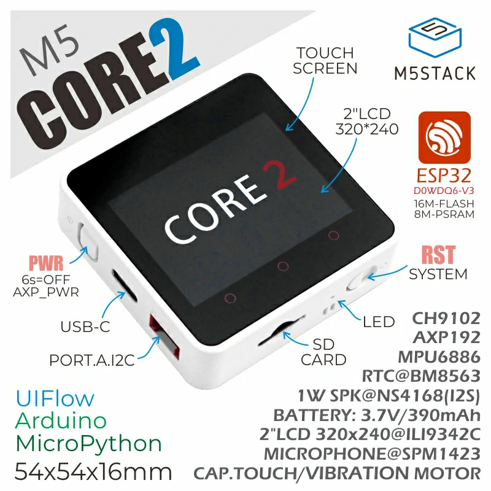

# BSP: M5Stack Core 2

* [Hardware Reference](https://docs.m5stack.com/en/core/core2)

M5Core2 is the second generation core device in the M5Stack development kit series, which further enhances the functions of the original generation of cores.

The MCU is an ESP32 model D0WDQ6-V3 and has dual core Xtensa® 32-bit 240Mhz LX6 processors that can be controlled separately. Wi-Fi are supported as standard and it includes an on board 16MB Flash and 8MB PSRAM, USB TYPE-C interface for charging, downloading of programs and serial communication, a 2.0-inch integrated capacitive touch screen, and a built-in vibration motor.

M5Core2 also features a built-in RTC module which can provide accurate timing. The power supply is managed by an AXP192 power management chip, which can effectively control the power consumption of the base and a built-in green LED power indicator helps to notify the user of battery level. The battery capacity has been upgraded to 390mAh, which can power the core for much longer than the previous model.

The M5Core2 retains the TF-card(microSD) slot and speakers. However, in order to ensure higher quality sound output, the I2S digital audio interface power amplifier chip is used to effectively prevent signal distortion. There are independent power and reset buttons on the left side and bottom of the base.

The 3 icons on the front of the screen are capacitive buttons which are programmable. There is a small expansion board on the back of the base with a 6-axis IMU sensor and microphone. The development platform and programming language supported by M5Stack Core2: Arduino, UIFlow (using Blockly, MicroPython language) No matter what level of your development and programming skills, M5Stack will help You gradually turn your ideas into reality.

